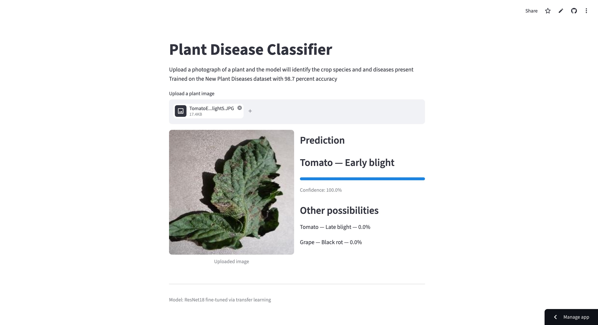
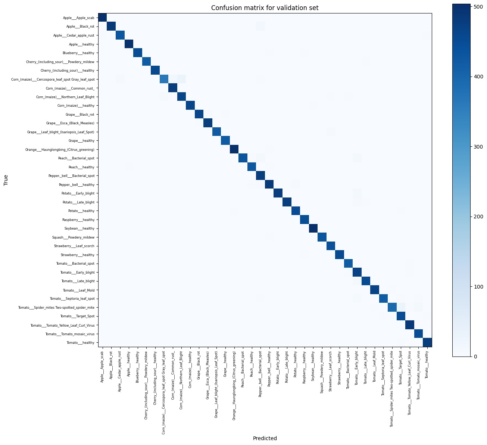

# Crop Disease Classification

An end to end deep learning system that identifies plant diseases based on photographs of leaves.\
Upload an image of a leaf and the model returns the crop species, the disease present (or if no disease is present, a healthy determination), and a confidence score.\
[Live Demo](https://plant-project-4pmiukf5c7lyix79q2vvaf.streamlit.app/)\


## Results

| Metric | Value |
| --- | --- |
| Validation accuracy | 98.3% |
| Classes | 38 (14 crop species, in both healthy and diseased states) |
| Training images | ~70,000 |
| Architecture | ResNet18, fine-tuned through transfer learning |

## Diagnosing and Correcting Overfitting

- The initial model was trained without augmentation, and received around 95.6 percent validation accuracy after one epoch, yet declined to 94.7 percent after the second epoch, while training accuracy rose from 92% to 96.4%.
- Validation loss also increased, even as training loss fell.
- This divergence that was observed between training and validation performance was a clear indicator of overfitting - the model was memorizing the training set instead of generalizing.

### Solution

#### Data Augmentation on the Training Set

- Random horizontal flips and rotations up to 15 degrees.
- Validation images were left unaltered, so that evaluation remained a measure of performance on unmodified data.

#### Validation based checkpointing

- Weights were saved whenever validation accuracy reached a new best, instead of only at the end of training
- In the baseline training, the best model was produced after one epoch, but was overwritten by weaker weights in epoch two

## Evaluation

### Confusion Matrix



- Overall, the model was able to correctly identify the class for each image during validation, as evidenced by the almost perfect diagonal line descending from left to right
- However, the model made more incorrect predictions for photos of Corn with Cercospora leaf spot/Gray Leaf Spot, mistakenly labeling it as Corn with Northern Leaf Blight.
- Rather than a simple arbitrary failure, this is meaningful, as Northern Leaf Blight can appear similar to Cercospora leaf spot, typically taking the form of elongated grey or tan lesions on the leaf of the plant
- More confusions occurred in the Tomato class, with Tomato - 2 spotted spider mites being mistakenly labeled a few times as Tomato - Target Spot.
- Misclassifications tend to occur within plant classes rather than across classes, meaning that the model reliably can identify plant species level features, and only falters on diseases with difficult boundaries.

## Approach

### Data

- The model is trained on the [New Plant Diseases dataset](https://www.kaggle.com/datasets/vipoooool/new-plant-diseases-dataset), which contained around 87,000 labeled leaf images (70,000 training and 17,000 validation) split across 38 classes.
- Each class corresponded with a plant species paired with a condition, or a healthy state.
- Initial exploration that I conducted confirmed that the dataset was approximately balanced across classes, with each image being a uniform 256 x 256 pixels.
- These uniform properties meant that no class weighting or data cleaning steps were required, and my data pipeline could load images directly from their class directory.
- The dataset provided its own train/validation split of around 80/20.
- The dataset's test directory contained 33 images with single leaves against uniform backgrounds
- The reported accuracy is validation accuracy, which is also used for checkpoint selection

### Model

- Transfer learning was utilized, with ResNet18, which is pretrained on ImageNet.
- The final fully connected layer was replaced with a new layer that mapped the network's learned features onto the 38 target classes.
- Input images were resized to 224 x 224 and were normalized using ImageNet statistics: `mean=[0.485, 0.456, 0.406]` and `std=[0.229, 0.224, 0.225]`, matching the expectations of the pretrained weights
- Training used cross entropy loss and the Adam optimizer with a learning rate of 0.001, and a batch size of 32.

### Serving

#### FastAPI

- A `/predict` endpoint that accepts an uploaded image and returns top three predictions with confidence scores in a JSON format
- The model is loaded once at application startup instead of per request

#### Streamlit

- Web interface for uploading an image and viewing the predictions directly

## Tech Stack

**ML:** PyTorch, torchvision, scikit-learn (evaluation metrics)\
**Serving:** FastAPI, Streamlit, Pillow\
**Infrastructure:** Git LFS\
**Development:** Google Colab (training)\

## Running Locally

The trained model is stored using git LFS, so that needs to be installed first

```bash
git lfs install
git clone https://github.com/Abhi712-ui/Plant-Project.git
cd Plant-Project
python -m venv .venv && source .venv/bin/activate
pip install -r requirements.txt
```

Streamlit interface

```bash
streamlit run streamlit_app.py
```

API

```bash
uvicorn app.main:app --reload
```
